# API TRANSU

Para poder hacer funcionar este proyecto el único requisito es tener [Docker](https://www.docker.com/) instalado en su equipo de cómputo.

Una vez teniendo esto, debe de abrir una terminal y moverse a la misma carpeta en la que se encuentra el archivo [dokcer-compose.yml](docker-compose.yml) y ejecutar el siguiente comando dentro de su terminal:

`docker-compose up -d --build`

Y cuando acabe de construir los contenedores, el proyecto se encuentra en ejecución.

___

Podrá ver los estatus de los contenedores con el comando : `docker ps -a`

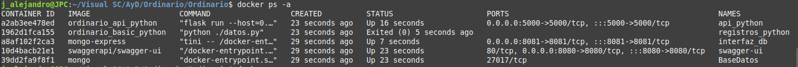

El Status del segundo contenedor se muestra como 'Exited' ya que este acabo su tarea, la cual es de ingresar registros (tanto para usuarios y transacciones) provenientes de los archivos [user.json](./info/users.json) y [transfer.json](./info/transfer.json) dentro de [Mongo](https://www.mongodb.com/es).

Los registros se pueden ver dentro de [http://localhost:8081/](http://localhost:8081/), debera ingresar con las credenciales:

- Nombre de usuario : **admin**
- Contraseña : **ordinario**

Selecciona la db de nombre: *'Ordinario'* , y alguna de las dos colecciones : *'transcciones'* y *'usuarios'*

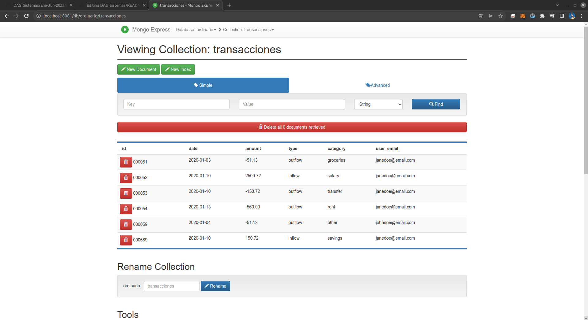

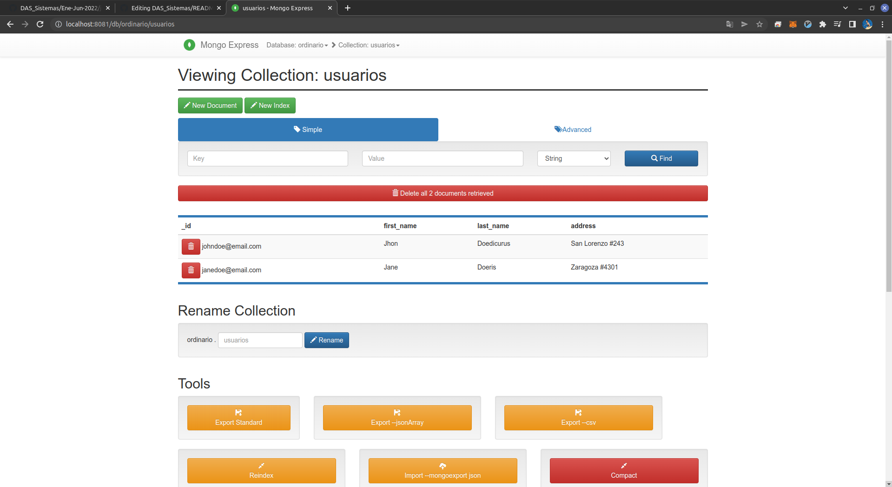

___

El puerto en donde se muestra la [API](https://aws.amazon.com/es/what-is/api/#:~:text=API%20significa%20%E2%80%9Cinterfaz%20de%20programaci%C3%B3n,de%20servicio%20entre%20dos%20aplicaciones.) es [http://localhost:5000/](http://localhost:5000/) :

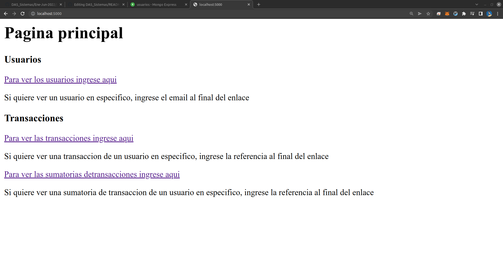

Dando click en [Para ver los usuarios ingrese aqui](http://localhost:5000/users) hará una petición GET y verá lo siguiente:

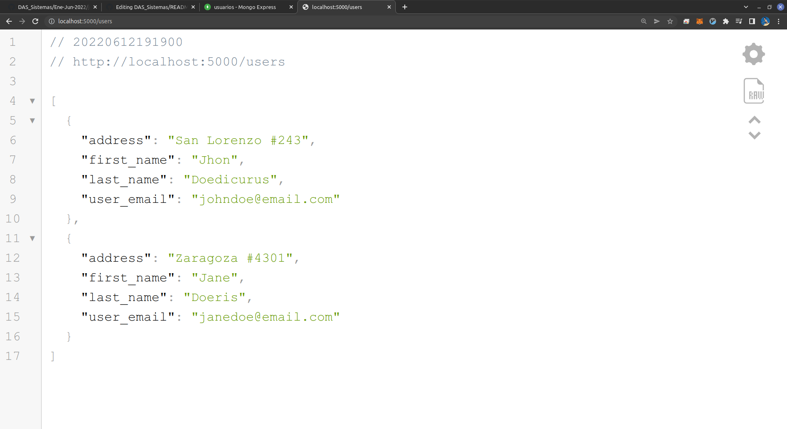

___

Para poder realizar todas las operaciones CRUD de forma más fácil, se pueden realizar a través de un cliente rest GUI como [Postman](https://www.postman.com/), [Insomnia](https://insomnia.rest/); también, claro con herramientas CLI como [cURL](https://curl.se/), extensiones para VSC como [Thunder Client](https://www.thunderclient.com/), etc...

En este caso usaremos Postman.

Para poder agregar una nueva transacción, debe de cumplir con las siguientes reglas : 
- La referencia es única.
- Solamente existen dos tipos de transacción: inflow y outflow.
- Todas las transacciones de tipo outflow son numeros decimales negativos.
- Todas las transacciones de tipo inflow son numeros decimales positivos.

Haciendo POST a [http://127.0.0.1:5000/transactions](http://127.0.0.1:5000/transactions) con valore que violen las anteriores reglas, mostrará un mensaje indicándolo : 

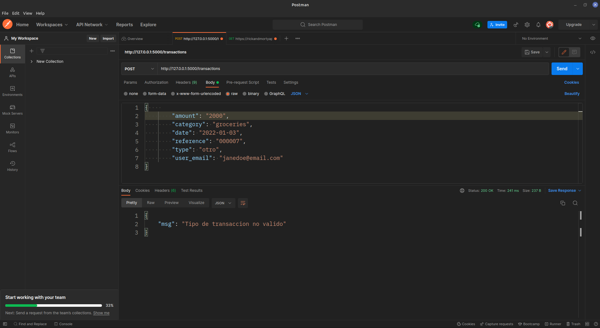

Con datos válidos muestra:

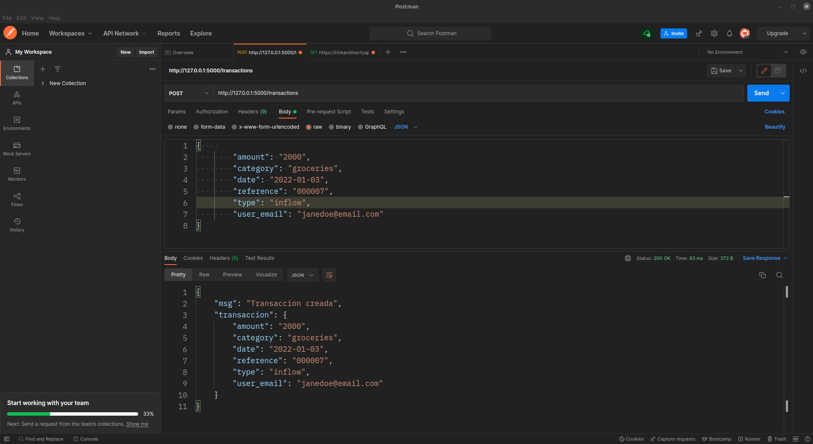

Ingresando a [http://localhost:8081/db/ordinario/transacciones](http://localhost:8081/db/ordinario/transacciones) mostrará la última transacción ingresada:

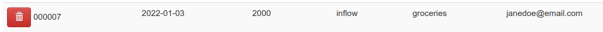

También se puede hacer GET especificando la reference de la transacción que se quiere obtener:

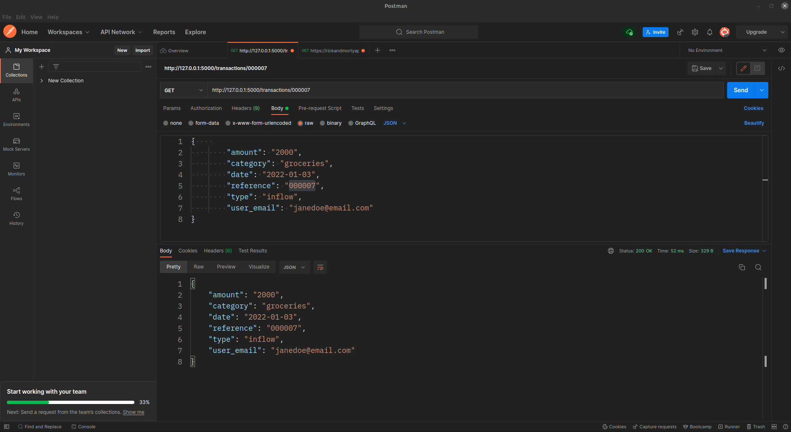

Realizando PUT :

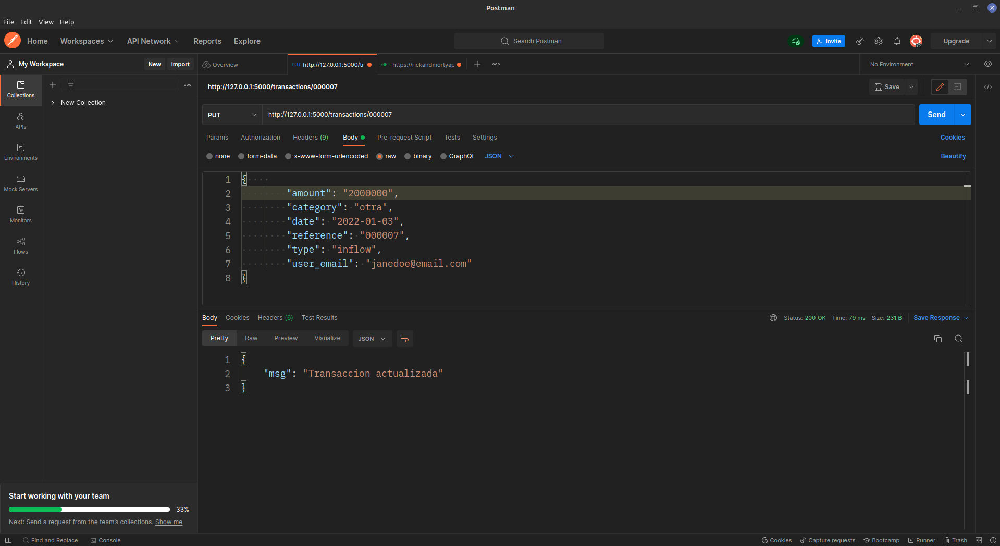

Haciendo DELETE:

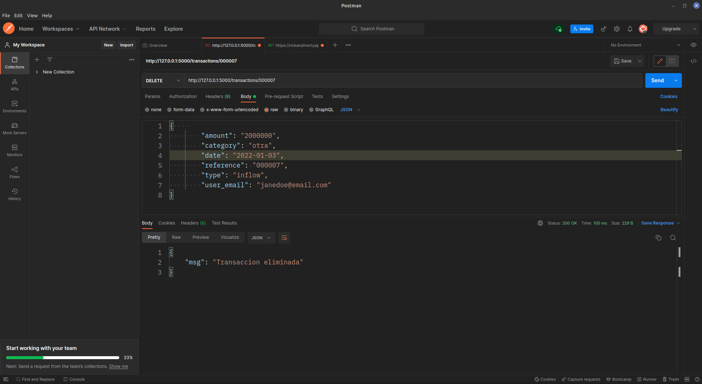

___

De igual forma la api contempla el CRUD para usuarios, y los resumenes de transacciones.

Ingresando a [http://localhost:8080/](http://localhost:8080/) observará el [Swagger UI](https://hub.docker.com/r/swaggerapi/swagger-ui) de la aplicación, en donde podrá interactuar con la API:

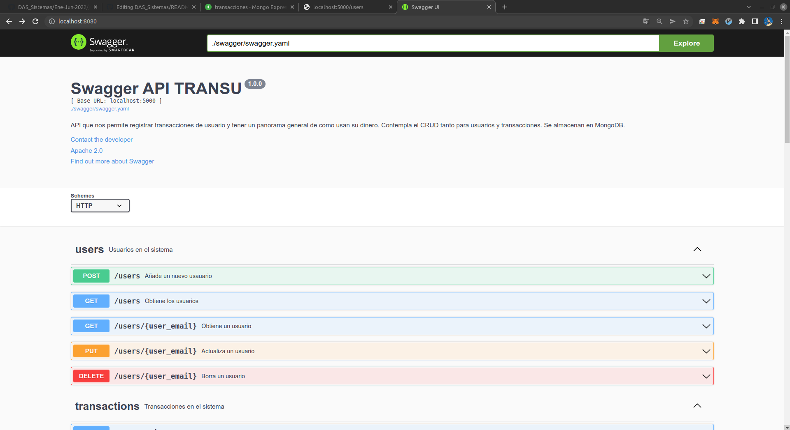

Haciendo GET a [http://localhost:5000/summary/transactions](http://localhost:5000/summary/transactions) a través de Swagger UI:

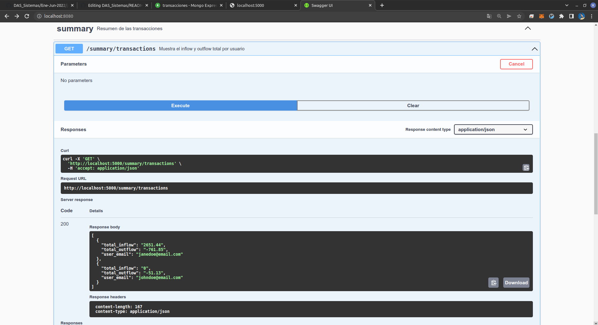

___

## Diagrama entidad relacion
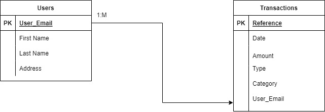

## Diagrama de contenedores de Docker
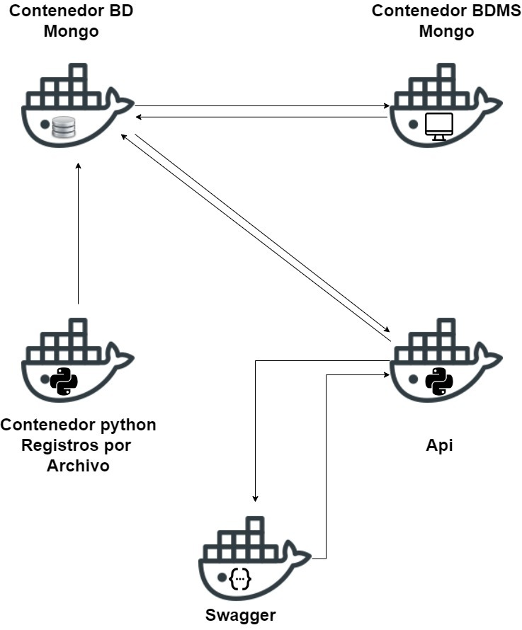